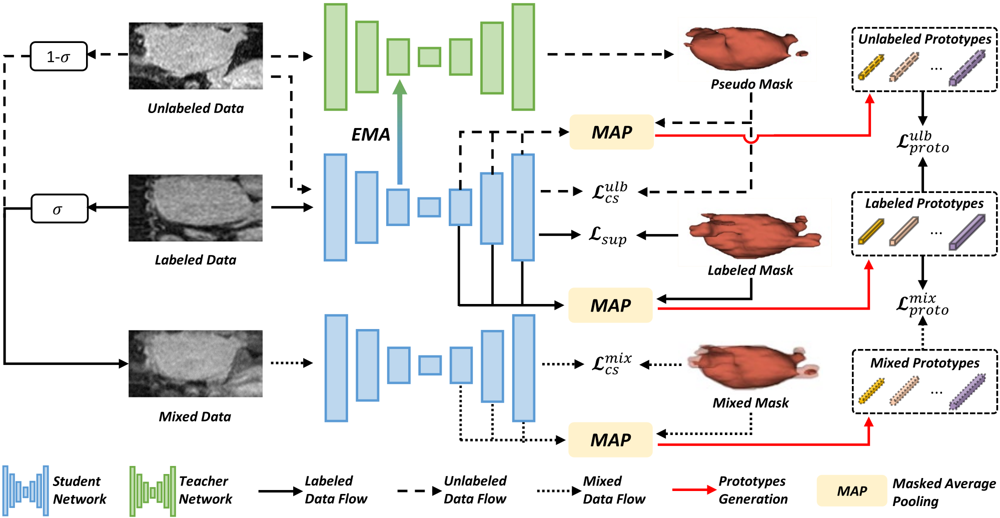

# Dual Cross-image Semantic Consistency with Self-aware Pseudo Labeling for Semi-supervised Medical Image Segmentation

by [Han Wu](https://hanwu.website/)\*, [Chong Wang](https://cwangrun.github.io/)\*, and [Zhiming Cui](https://shanghaitech-impact.github.io/)<sup>+</sup>.

[[arXiv](https://arxiv.org/abs/2507.21440)] [[IEEE TMI Paper](https://ieeexplore.ieee.org/abstract/document/11104231)]

This repository contains the code and dataset for our paper "Dual Cross-image Semantic Consistency with Self-aware Pseudo Labeling for Semi-supervised Medical Image Segmentation" in IEEE TMI 2025.

## Abstract



Semi-supervised learning has proven highly effective in tackling the challenge of limited labeled training data in medical image segmentation. 
In general, current approaches, which rely on intra-image pixel-wise consistency training via pseudo-labeling, overlook the consistency at more comprehensive semantic levels (e.g., object region) and suffer from severe discrepancy of extracted features resulting from an imbalanced number of labeled and unlabeled data. 
To overcome these limitations, we present a new **Du**al **C**ross-**i**mage **S**emantic **C**onsistency (DuCiSC) learning framework for semi-supervised medical image segmentation. 
Concretely, beyond enforcing pixel-wise semantic consistency, 
DuCiSC proposes dual paradigms to encourage region-level semantic consistency across: 1) labeled and unlabeled images; and 2) labeled and fused images, 
by explicitly aligning their prototypes. 
Relying on the dual paradigms, 
DuCiSC can effectively establish consistent cross-image semantics via prototype representations, 
thereby addressing the feature discrepancy issue. 
Moreover, we devise a novel self-aware confidence estimation strategy to accurately select reliable pseudo labels, allowing for exploiting the training dynamics of unlabeled data. 
Our DuCiSC method is extensively validated on four datasets, including two popular binary benchmarks in segmenting the left atrium and pancreas, a multi-class Automatic Cardiac Diagnosis Challenge dataset, and
a challenging scenario of segmenting the inferior alveolar nerve that features complicated anatomical structures,
showing superior segmentation results over previous state-of-the-art approaches. 

## Getting Started

Our code is built upon [SSL4MIS](https://github.com/HiLab-git/SSL4MIS) and [MC-Net](https://github.com/ycwu1997/MC-Net). You can refer to these repositories for detailed environment configuration and dataset set-up.

## Training & Testing

### Training

To train the model, run:

```python
cd DuCiSC
python code/train_DuCiSC.py --dataset_name LA --labelnum 8  --gpu 0
python code/train_DuCiSC.py --dataset_name LA --labelnum 16 --gpu 0
python code/train_DuCiSC.py --dataset_name Pancreas --labelnum 6 --gpu 0
python code/train_DuCiSC.py --dataset_name Pancreas --labelnum 12 --gpu 0
```

### Testing

To test the trained model:

```python
cd DuCiSC
python code/test_3d.py --dataset_name LA --output_dir ./your_log_dir/  --gpu 0
```

## Checkpoints

Our checkpoints are available at https://drive.google.com/drive/folders/1iyt4N2Sb7_rX-pul5GFep3ptWSgIM2Cs?usp=sharing. 

## Citation

If you find this code useful for your research, please cite our paper:

```bibtex
@article{wu2025dual,
  title={Dual Cross-image Semantic Consistency with Self-aware Pseudo Labeling for Semi-supervised Medical Image Segmentation},
  author={Wu, Han and Wang, Chong and Cui, Zhiming},
  journal={IEEE Transactions on Medical Imaging},
  year={2025},
  publisher={IEEE}
}
```


## Acknowledgements

Our code was built upon [SSL4MIS](https://github.com/HiLab-git/SSL4MIS) and [MC-Net](https://github.com/ycwu1997/MC-Net). We thank the authors for making their code publicly available.


## Questions
If any questions, feel free to contact me at wuhan2022@shanghaitech.edu.cn.
